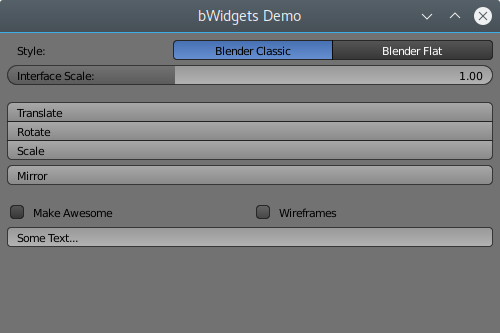

# bWidgets

bWidgets is a cross-platform widget toolkit, designed specifically for the Blender project, but reusable as a standalone library.

Plan is to replace big parts of Blender's widget code with bWidgets. In short, doing so will greatly improve Blender's interface code while opening doors for new features.

A "b"-prefix is a common convention in Blender's source code to mark internal Blender C-structs. The name "bWidgets" refers to this. It's fine to pronounce bWidgets as "Blender-widgets" too.

## Motivation

The motivation for bWidgets mainly comes from Blender, but is not limited to it. The main motivations are:

* Refactor of Blender's widget code

  A rather major refactor of Blender's widget code is really needed. Although some parts were refactored during the 2.5 project, most code is still from the nineties.

* Support for "GUI Styles" in Blender

  It was an idea to allow users to choose from multiple visual style presets in Blender, see [T45025](https://developer.blender.org/T45025). 
  Support for such style presets is built into bWidgets. However, bWidgets could go even further by supporting CSS-like editing of styles. Most modern widget toolkits do this to allow changing their look & feel, with great success. Plus, Blender users could create and share their own styles.

* Sharing Blender's widget code with other apps

  Various applications could use bWidgets to get the look and feel of Blender's widgets (without having to mimic it manually). The Blender Animation Player or the Cycles standalone could make good use of this.

  Another use-case would be building a UI protoyping app for Blender. Users, script-authors and Blender developers could use it for testing and communicating ideas. This could be really helpful.

* Getting closer to Qt (and similar toolkits)

  Qt is a (the most?) popular widget toolkit. It is incredibly powerful and flexible, developers are familiar with it. While there are no concrete plans to switch to Qt, bWidgets helps finding out if such a switch would make sense and how feasible it is.

  bWidgets is in fact designed similar to Qt. Partially because they try to address similar requirements, partially because Qt is purposely being used as reference.

## Current Features

As of now, bWidgets basically contains a few widget definitions with simple drawing and handling mimicking Blender. It further supports:
* A primitive style preset system (only supporting the current built-in styles)
* A drawing system via a graphics framework independent drawing interface

  Basically a *painter* object defines geometry as *polygons* and draws them through a *paint-engine*. The paint-engine is created by the application that uses bWidgets. It can be a paint-engine for OpenGL drawing, Vulcan drawing, HTML/CSS export, etc.
* Scaling
* Primitive gradient drawing
* Primitive (and hacky) anti-aliasing for widget outlines.

The demo application has basic features like a primitive layout system, font drawing using FreeType2, GLSL shader support, scrolling and DPI scaling. Most buttons are dummies showing off the bWidgets feature set.

Further, there is a documentation and unit testing framework for both bWidgets and its demo application.

## Future Plans

Like mentioned earlier, it's planned to replace big parts of Blender's widget pipeline by bWidgets. This is a major undertaking and we plan to do it step-by-ste:

1. Make Blender use bWidgets for the widget drawing. Basically replace Blender's [`interface_widgets.c`](https://developer.blender.org/diffusion/B/browse/master/source/blender/editors/interface/interface_widgets.c).
2. Port basic widget interaction handling from Blender to bWidgets.

   That is, code that controls how push-buttons change their state on mouse clicks, how scrollbars react to dragging, etc. At this point we might want to add some text-editing API to bWidgets.
Eventually, all code in Blender's giant [`interface_handlers.c`](https://developer.blender.org/diffusion/B/browse/master/source/blender/editors/interface/interface_handlers.c) that does not depend on Blender data should be replaced by bWidgets.
3. Add a layout-system to bWidgets

   Qt shows an interesting approach to this that bWidgets could follow: Instead of a linear list of widgets, there is a widget hierarchy where widgets can contain child-widgets. Each parent widget is then responsible for the layout of its childs, optionally connecting to a layout-engine.

  For Blender, this would replace the need for the uiBlock struct which only allows linear widget storage. It would further integrate the layout system much better with the widget storage. The layout system usage via the BPY should stay compatible.

## Further Documentation

Further documentation, like general code design overviews and detailed code documentation, can be found here: https://julianeisel.github.io/bWidgets/.

## Supported Platforms

bWidgets itself only requires a compiler supporting the C++11 ABI. 
The demo application however requires Freetype2 and OpenGL 3.3 to compile and run.

bWidgets and its demo application have successfully been built on following platforms:
* Linux Debian 9, GCC 6.3
* Windows 7, MSVC 2017 (only compiled, couldn't launch due to OpenGL driver issues)

More platforms/compilers should be tested.
